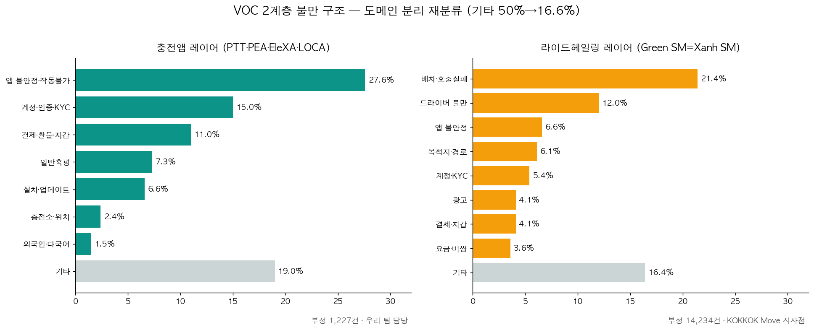

# 📊 데이터 분석 결과서
## Kokkok EV — 동남아 EV 충전 서비스 VOC 분석

> **작성일**: 2026-06-05
> **작성자**: 마수한 (Data Engineer & PM)
> **분석 기간**: 2026-05-31 ~ 2026-06-05

> 🔄 **2026-06-13 도메인 분리 재분류 반영** — VOC를 (1)라이드헤일링 (2)충전 (3)앱공통 도메인으로 분리하고 다국어(vi/th/en/ko) 세분화. §2-3 불만 카테고리 표를 2계층 분포로 교체, §4·§5 인과 주장 보정, §7 한계 항목 추가. (산출물: `src/review_classifier.py`, `notebooks/09_review_reclassification.ipynb`, `outputs/18_complaint_2layer.png`)

---

## 1. 분석 개요

### 분석 목적

동남아(라오스·베트남·태국) EV 충전 서비스의 사용자 불만을 **앱 레이어**와
**하드웨어 레이어** 두 축에서 정량 분석하여, 데이터에 근거한 서비스 개선 기능을 제안한다.

### 분석 대상 및 데이터 현황

| 데이터 소스 | 건수 | 전처리 완료 |
|-------------|------|-----------|
| 앱스토어 리뷰 (5개 앱) | **28,890건** | 언어감지·감성분석·키워드분류 ✅ |
| 유튜브 자막 (STT) | **2,625세그먼트** | 언어감지 ✅ |
| 유튜브 댓글 | **527건** | 언어감지·감성분석·키워드분류 ✅ |
| 네이버 블로그 | **42건** | 언어감지·감성분석 ✅ |
| 뉴스 (VOC) | **733건** | 언어감지·감성분석·키워드분류 ✅ |
| 뉴스 (하드웨어) | **1,327건** | 언어감지·감성분석·키워드분류 ✅ |
| **합계** | **34,144건** | |

---

## 2. 앱 레이어 분석

### 2-1. 포지셔닝 맵 분석

5개 앱을 **평균 별점 × Negative 비율**로 포지셔닝한 결과:

| 앱 | 평균 별점 | 리뷰 수 | Negative 비율 | 포지션 |
|----|---------|--------|------------|------|
| LOCA EV | **5.0⭐** | 7건 | 14.3% | 리뷰 없음 — 분석 제외 |
| **PTT blueplus+** | **3.11⭐** | 1,518건 | 47.6% | ✅ **동남아 1위** — 비교 벤치마크 |
| Green SM | 2.56⭐ | 26,603건 | 53.5% | 🔴 **핵심 분석 대상** |
| EleXA | 2.41⭐ | 263건 | 62.4% | 🔴 하위권 |
| **PEA VOLTA** | **2.28⭐** | 499건 | **67.9%** | 🔴 **최하위 — 가장 심각** |

**핵심 인사이트:**
- PTT blueplus+(태국 1위)와 Green SM(라오스·베트남)의 별점 격차 = **0.55점**
- PEA VOLTA는 67.9% Negative로 서비스 전반 재설계 수준의 문제 존재
- 동남아 EV 충전 앱 전반이 평균 2.5점대 → 업계 전체의 구조적 문제

---

### 2-2. 감성 분석 결과

**앱 리뷰 전체 (28,890건)**

| 감성 | 건수 | 비율 |
|------|------|------|
| Negative | **15,461건** | **53.5%** |
| Neutral | 7,237건 | 25.1% |
| Positive | 6,192건 | 21.4% |

**언어별 감성 — 국가별 차이 확인**

| 언어 | 총 건수 | Negative | 평균 별점 |
|------|--------|---------|---------|
| vi (베트남어) | 22,475건 | **54.8%** | 2.46⭐ |
| th (태국어) | 2,073건 | 53.6% | 2.86⭐ |
| **en (영어)** | 1,992건 | **65.8%** | 2.55⭐ |
| ko (한국어) | 77건 | 57.1% | 2.77⭐ |

> 📌 영어 리뷰 Negative 65.8% — 다국적 여행자·외국인 사용자가 현지인보다 불만이 더 높음.
> 언어 장벽과 국제 결제 수단 미지원이 원인으로 추정.

**별점 vs 감성 교차 — 단조 일치 확인**

| 별점 | Negative 비율 |
|------|-------------|
| 1점 | 78.0% |
| 2점 | 76.4% |
| 3점 | 69.0% |
| 4점 | 37.5% |
| 5점 | 8.8% |

→ 별점이 낮을수록 Negative 비율이 단조적으로 높아짐 → 별점과 감성이 **단조 일치(약한 동시타당도)**를 보임

---

### 2-3. 불만 카테고리 분석 — 2계층 도메인 분리 (🔄 2026-06-13 재분류)

> 🔄 **재분류 배경**: app_reviews 28,890건의 **92%가 Green SM**(베트남 EV '라이드헤일링' 앱 Xanh SM)이다.
> 기존 충전 7개 카테고리 체계로는 부정 리뷰의 **50%가 '기타'**로 빠졌다.
> (1)라이드헤일링 (2)충전 (3)앱공통 **도메인 분리** + 다국어(vi/th/en/ko) 세분화 재분류로
> **기타 50.0% → 16.6%** 로 크게 줄였다.
> *(기존 "앱오류 58.6%/5,840건, 결제오류 16.8% …" 표는 분모를 임의 축소한 옛 수치라 폐기)*



**부정 리뷰 15,461건 — 도메인 분포**

| 도메인 | 건수 | 비율 |
|--------|------|------|
| 라이드헤일링 | 6,552건 | **42.4%** |
| 앱공통 | 6,064건 | **39.2%** |
| 기타·미상 | 2,567건 | 16.6% |
| 긍정오분류 | 173건 | 1.1% |
| 충전전용 | 105건 | 0.7% |

**① 충전앱 레이어** (PTT·PEA·EleXA·LOCA, 부정 **1,227건**)

| 순위 | 카테고리 | 비율 |
|------|---------|------|
| 1 | **앱 불안정·작동불가** | **27.6%** |
| 2 | 계정·인증·KYC | 15.0% |
| 3 | 결제·환불·지갑 | 11.0% |
| 4 | 일반혹평 | 7.3% |
| 5 | 설치·업데이트 | 6.6% |
| 6 | 충전소·위치 | 2.4% |
| 7 | 외국인·다국어 | 1.5% |
| — | 기타 | 19.0% |

**② 라이드헤일링 레이어** (Green SM, 부정 **14,234건**)

| 순위 | 카테고리 | 비율 |
|------|---------|------|
| 1 | **배차·호출실패** | **21.4%** |
| 2 | 드라이버 | 12.0% |
| 3 | 앱 불안정 | 6.6% |
| 4 | 목적지·경로 | 6.1% |
| 5 | 계정·KYC | 5.4% |
| 6 | 광고 | 4.1% |
| 6 | 결제·지갑 | 4.1% |
| 8 | 요금 | 3.6% |
| — | 기타 | 16.4% |

> 📌 **맥락**: KOKKOK Move는 라오스 현지 운영 중인 EV 라이드헤일링이며,
> KOKKOK 슈퍼앱(모빌리티+쇼핑+EV충전)으로 확장 준비 중이다. 우리 팀은 **EV 충전 파트**를 담당한다.

---

### 2-4. 경쟁 분석 — 앱별 불만 카테고리 비교

| 앱 | 앱오류 1위 | 결제오류 2위 | 특이사항 |
|----|----------|-----------|--------|
| Green SM | ✅ | ✅ | 전체 리뷰 26,603건으로 분석 신뢰도 가장 높음 |
| PTT blueplus+ | ✅ | ✅ | 불만 비율이 가장 낮음 — 벤치마크 대상 |
| PEA VOLTA | ✅ | ✅ | Negative 67.9%로 UI불편·충전소위치 불만도 상대적으로 높음 |
| EleXA | ✅ | ✅ | EGAT 운영으로 고객서비스 불만 상대적으로 높음 |

---

### 2-5. 워드클라우드 분석 — 다국어

**베트남어 (vi, 22,475건)**
- 빈출 부정 단어: `lỗi` (오류), `chậm` (느림), `không` (안됨), `sạc` (충전)
- 패턴: "앱 오류가 자꾸 나서 충전이 안 됨"이 반복적

**태국어 (th, 2,073건)**
- 빈출 부정 단어: `ช้า` (느림), `เสีย` (고장), `ไม่ได้` (안됨), `แอป` (앱)
- 패턴: 충전 속도 불만이 베트남보다 상대적으로 높음

**영어 (en, 1,992건)**
- 빈출 부정 단어: `payment`, `error`, `failed`, `QR`, `connect`
- 패턴: 외국인 여행자는 결제 수단 문제를 가장 많이 언급

---

## 3. 하드웨어 레이어 분석

### 3-1. 포지셔닝 맵

하드웨어 이슈를 **뉴스 건수(언급 빈도) × Negative 비율(심각도)**로 포지셔닝:

| 카테고리 | 뉴스 건수 | Negative 비율 | 긴급도 |
|----------|---------|------------|------|
| **충전기결함** | 75건 | **32.0%** | 🔴 **즉시 대응 필요** |
| OCPP·호환문제 | 169건 | 1.2% | 🟠 건수 많음 — 업계 화두 |
| 설치·인프라 | 144건 | 1.4% | 🟡 확장 중 |
| 제조사동향 | 94건 | 1.1% | 🟡 Costel 동향 |
| 시장·정책 | 113건 | 2.7% | 🟡 규제 변화 주시 |

**핵심 인사이트:**
- **충전기결함** Negative 32%로 압도적으로 높음 → "기기 자체가 망가진" 케이스가 많음
- **OCPP 이슈**는 Negative는 낮지만 언급 건수 169건으로 업계 전반의 표준화 화두

---

### 3-2. 국가별 하드웨어 이슈 경쟁 분석

| 국가 | 주요 이슈 | 특이사항 |
|------|---------|--------|
| 한국 (KOR) | 제조사동향 중심 | Costel 수출·인증 뉴스 위주 |
| 베트남 (VNM) | 설치·인프라 위주 | 충전소 구축 확장 단계 |
| 태국 (THA) | 충전기결함·OCPP 이슈 | 이미 인프라 구축 후 품질 문제 단계 |
| 다국가 (MUL) | OCPP 표준화 | 글로벌 호환성 이슈 |

> 📌 라오스·베트남은 **인프라 구축 단계**, 태국은 **품질·표준화 단계**
> → Kokkok EV 서비스는 지금부터 품질 기준을 높게 잡아야 향후 태국 단계에서 경쟁 우위 확보 가능

---

### 3-3. 워드클라우드 — 다국어 하드웨어 이슈

빈출 단어 (한·영·베·태 통합):
- `OCPP`, `charging`, `connector`, `충전기`, `호환`, `trạm sạc`, `ชาร์จ`
- `failure`, `broken`, `error`, `고장`, `lỗi`, `เสีย`
- `protocol`, `standard`, `firmware`, `표준`

---

## 4. 앱 ↔ 하드웨어 연계 분석

### 핵심 발견: 충전앱 불만은 OCPP가 아니라 앱·온보딩·결제 문제 (🔄 2026-06-13 보정)

> 🔄 **인과 주장 보정**: 기존 "앱오류 = OCPP 통신 문제" 인과 주장은 **충전앱 VOC가 뒷받침하지 않는다.**
> 2계층 재분류 결과, 충전앱(PTT·PEA·EleXA·LOCA) 부정 리뷰의 상위는
> **① 앱 불안정·작동불가 27.6% · ② 계정·인증·KYC(온보딩) 15.0% · ③ 결제·환불·지갑 11.0%** 이다.
> 즉 충전앱 #1 불만은 **앱 자체 안정성·온보딩(KYC/로그인)·지갑결제**이며, OCPP 통신과의 인과는 데이터로 확인되지 않는다.

```
[충전앱 리뷰 상위 불만 (부정 1,227건)]

① 앱 불안정·작동불가   27.6%
② 계정·인증·KYC        15.0%   ← 온보딩(가입/로그인) 장벽
③ 결제·환불·지갑       11.0%
```

**결론**: 충전앱 개선의 1순위는 **앱 안정성 확보 + 온보딩(KYC/로그인) 간소화 + 지갑·결제 신뢰성**이다.
OCPP 2.0.1은 충전기↔백엔드 연동의 **기술 표준 요건**으로 별도 추진할 수 있으나,
앱 리뷰 불만의 직접 원인으로 단정할 근거는 없다.

---

## 5. 핵심 인사이트 요약

### 🔴 즉시 해결 필요 (Critical)

1. **충전앱 #1 불만 = 앱 안정성·온보딩·지갑결제** (🔄 2026-06-13 보정)
   - 근거: 충전앱 부정 1,227건 중 앱 불안정·작동불가 27.6% · 계정·인증·KYC 15.0% · 결제·환불·지갑 11.0%
   - 해결: 앱 크래시·작동불가 안정화 + KYC/로그인 온보딩 간소화 + 지갑·환불 신뢰성 강화
   - 참고: "앱오류=OCPP" 인과는 충전앱 VOC가 뒷받침하지 않음. OCPP 2.0.1은 HW 기술 표준 요건으로 별도 추진

2. **결제·환불·지갑 11.0% (충전앱 레이어) — 태국 1위(PTT)와의 핵심 격차**
   - 근거: 충전앱 부정 1,227건 중 결제·환불·지갑 11.0% / PTT는 앱+카드 이중 결제로 만족도 우위
   - 해결: RFID 오프라인 결제 도입

3. **PEA VOLTA Negative 67.9% — 동남아 최악의 UX**
   - 근거: 499건 중 339건 부정
   - 인사이트: Kokkok EV가 PEA VOLTA 수준만 피해도 시장 경쟁력 확보

### 🟠 단기 개선 (High)

4. **영어 리뷰 Negative 65.8% — 외국인 여행자 이탈**
   - 근거: 영어 리뷰 평균 2.55점, 결제 수단 오류 집중
   - 해결: 국제 결제(Visa/Mastercard) + 다국어 UI 지원

5. **충전기결함 Negative 32% — 하드웨어 품질 문제**
   - 근거: 태국이 인프라 구축 완료 후 현재 품질 문제 단계
   - 해결: 충전기 OTA 펌웨어 업데이트, 실시간 기기 상태 모니터링

### 🟡 중기 개선 (Medium)

6. **충전속도 불만 — 태국어 리뷰 특히 높음**
   - 근거: 충전속도는 충전앱 레이어에서 소수, 충전소·위치 2.4%가 더 큼 (전체 코퍼스 기준 카운트는 도메인 분리 재분류로 폐기)
   - 해결: 충전 속도 사전 표시, 급속·완속 구분 안내

7. **OCPP 표준화 169건 — 업계 화두**
   - 근거: 글로벌 OCPP 2.0.1 전환 진행 중
   - 해결: Costel 등 제조사와 OCPP 2.0.1 준수 협약

---

## 6. PTT blueplus+ 벤치마킹

태국 1위 앱(별점 3.11점)이 타 앱 대비 우위를 보이는 이유:

| 항목 | PTT blueplus+ | Green SM | 격차 |
|------|-------------|---------|------|
| 평균 별점 | **3.11⭐** | 2.56⭐ | +0.55점 |
| Negative 비율 | **47.6%** | 53.5% | -5.9%p |
| 결제 방식 | 앱 + 카드 | 앱 전용 | 이중 지원 |
| 운영 네트워크 | PTT 주유소 연계 | 독립 충전소 | 편의시설 우위 |

→ Kokkok EV가 PTT 수준 달성 시 **동남아 시장 2위권 진입 가능**

---

## 7. 분석 한계 및 주의사항

| 항목 | 한계 | 영향 |
|------|------|------|
| LOCA EV 리뷰 7건 | 라오스 현지 앱 리뷰 문화 없음 | 라오스 단독 분석 불가 |
| 하드웨어 데이터 | 직접 측정값이 아닌 뉴스 기반 추정 | 인과관계 주장에 한계 |
| 번역 미완료 | 28,890건 중 5,150건만 번역 | 키워드 일부 누락 가능 |
| Green SM 단일 앱 | 라오스·베트남 동일 앱 사용 | 국가별 분리 분석 어려움 |
| langdetect 오분류 | 라오어(lo) 감지 불량, so/sk 등으로 오분류 | 라오어 리뷰 일부 누락 |
| Green SM 92% 편중 (🔄) | 데이터의 92%가 라이드헤일링 앱 → 충전 전용 VOC가 극소(부정 105건) | 2계층(라이드헤일링/충전앱) 분리로 대응 |
| 기타 16.6% 잔존 (🔄) | 재분류 후에도 키보드 오타·초단문·감성오분류 등 비분류성 잔존 | 추가 키워드/규칙으로도 분류 한계 |
| langdetect vi 편중 (🔄) | 베트남어(vi) 감지가 77.8%로 편중 | 타 언어 리뷰 일부 vi로 오귀속 가능 |

---

*분석 도구: Python (pandas, XLM-RoBERTa, Matplotlib, WordCloud)*
*데이터베이스: PostgreSQL / Supabase Cloud (laos-ev-voc-db)*
*분석 차트: outputs/ 폴더 18개 파일 참조 (🔄 18_complaint_2layer.png 추가)*
