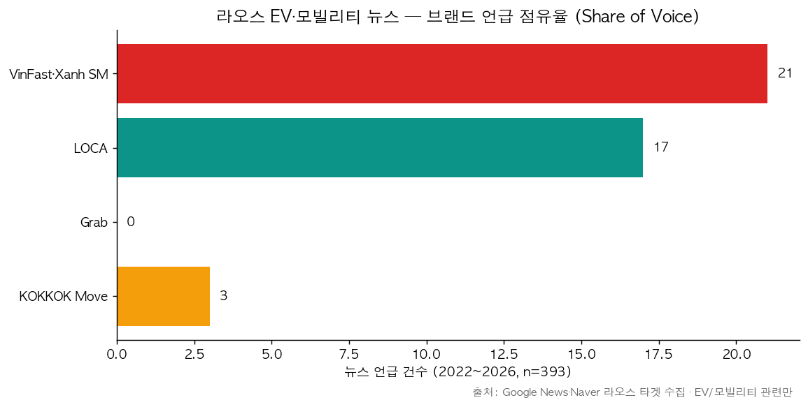
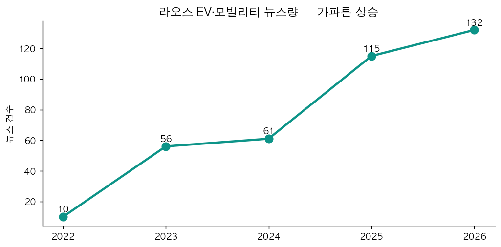

# 🇱🇦 라오스 EV·모빌리티 시장 — 뉴스 점유율(Share of Voice) 분석

> **작성일**: 2026-06-13 | **목적**: 라오스 **현지** 정량 근거 보강 — ① 임원진 벤치마크(LOCA EV)를 데이터로 독립 검증 ② 실제 경쟁사 발굴 ③ KOKKOK Move 현지 인지도 파악
> **재현**: [`notebooks/10_laos_news_collection.ipynb`](../notebooks/10_laos_news_collection.ipynb) · 차트 [`19_laos_share_of_voice.png`](19_laos_share_of_voice.png)·[`20_laos_news_trend.png`](20_laos_news_trend.png)

---

## 왜 이 분석을 했나

기존 VOC·시장 분석은 모두 **대용 표본**(베트남 Green SM·태국 충전앱·공식 통계)이었고, 정작 타겟 시장 **라오스의 현지 목소리가 비어 있었다**(LOCA EV 리뷰 7건·KOKKOK Move 슈퍼앱 리뷰 378건뿐). 임원진은 벤치마크로 **LOCA EV를 가정**으로 선택했는데, 이를 **데이터로 검증**하고 **놓친 경쟁사가 없는지** 확인하기 위해 라오스 뉴스 점유율을 수집·분석했다.

## 수집 방법

| 항목 | 내용 |
|------|------|
| 소스 | Google News RSS(en) + Naver News(ko) — 라오스 모빌리티/EV 초점 쿼리 19+6개 |
| 신규 수집 | **419건**(기존 URL 제외) → `news_articles`(country=`LAO`) 적재 |
| 분석 대상 | 라오스 실관련 + **EV·모빌리티 관련만 393건** (일반 비즈니스 뉴스 노이즈 제외) |
| 브랜드 분류 | 제목·본문 키워드 매칭(KOKKOK / LOCA / VinFast·Xanh SM / Grab) |

> ⚠️ **한계(정직하게)**: ① **라오어(lo) 쿼리는 Google News 색인 부재로 0건** — 영어·한국어 보도 중심. ② **Facebook(라오스 실질 담론 플랫폼)은 Meta API 제약으로 미수집**(향후 P2). ③ 브랜드 언급 절대량이 작음(41건) — 라오스 시장 소규모·보도량 자체가 적음. **점유율·인지도 프록시**로 해석(대형 N 통계 아님).

---

## 핵심 발견

### 1. 브랜드 점유율 — VinFast·Xanh SM > LOCA ≫ KOKKOK Move

| 브랜드 | 뉴스 언급 | 성격 |
|--------|----------|------|
| **VinFast · Xanh SM** | **21** | 🔴 베트남발 **EV 라이드헤일링** 신규 진입 — 가장 공격적 |
| **LOCA** | **17** | 🟢 라오스 **현지 1위** 택시·결제(LOCA PAY)·EV 충전 |
| Grab | **0** | 라오스 미진출 — 경쟁 대상 아님(경쟁군 축소 근거) |
| **KOKKOK Move** | **3** | 🟠 우리 서비스 — **미디어 인지도 거의 없음** |

> EV/모빌리티 관련 라오스 뉴스 393건 중 브랜드 명시 41건 기준.

### 2. 라오스 EV 뉴스량 — 5년간 13배 급증

2022년 10건 → 2026년 132건. EV 전환 모멘텀이 **보도량으로도 확인**됨(내연기관 수입 중단·EV 세제 정책과 정합).

### 3. 검증된 정성 신호 (헤드라인 근거)

- **VinFast·Xanh SM (위협)**: "Xanh SM signs strategic deal with AVILA to boost green mobility in Laos", "VinFast rolls out VF3, VF5 in Laos", "Vietnam presents 20 VinFast EVs to Laos" → **EV 차량 + EV 라이드헤일링을 동시에 라오스에 이식 중**. KOKKOK Move의 모빌리티 모델과 정면 경쟁.
- **LOCA (벤치마크 타당)**: "LOCA Stays The Number One Taxi Service In Laos", "PIDG invests $2.5M in LOCA", "LOCA PAY ... Visit Laos Year 2024" → **현지 1위 + 투자 유치 + 결제·관광 연계**. 임원진의 벤치마크 선택을 데이터가 뒷받침.
- **KOKKOK Move (인지도 공백)**: "LVMC·코코넛사일로 합작 'KOKKOK Move' 플랫폼 런칭" 류 런칭 보도 소수 → **출시 인지도가 낮은 상태에서 슈퍼앱 확장**.

### 4. 라오스 정부 정책 기조 — 강한 친(親)EV (늘리려는 기조)

> 질문: 라오스 정부는 EV를 **늘리려는가 / 줄이려는가 / 무관심한가?** → 뉴스 신호로 판정.

라오스 EV 관련 뉴스 486건의 정책 신호를 분류한 결과 **압도적으로 친EV**입니다.

| 정책 신호 | 방향 | 언급 |
|----------|------|------|
| 충전 인프라 확충 | 🟢 pro | **78건** |
| 보급 목표·로드맵·전환 가속 | 🟢 pro | **73건** |
| 보조금·인센티브 | 🟢 pro | 6건 |
| 가격 통제(보급 촉진용) | 🟢 pro | 4건 |
| 세제·등록세 면제 | 🟢 pro | 1건 |
| **EV 규제·축소** | 🔴 anti | **0건** (매칭 6건은 전수 검토 결과 전부 친EV 오탐) |

- **진짜 반(反)EV 신호는 0건.** "규제"로 매칭된 6건은 *"BYD seeks further EV perks", "Bosch supports EV progress", "Laos Accelerates Electric Mobility Transformation as EV Workforce Training, Policy…"* 등 전부 **친EV**였음(키워드 오탐).
- 헤드라인 직접 근거: **"Loca Transforms Taxis Into Electric Cars By 2030"**, **"Laos Accelerates Electric Mobility Transformation — EV Workforce Training, Policy"**, **"Xanh SM launches electric taxi … to promote green mobility"** → 정부·업계가 **전동화 전환을 적극 가속**.
- 별도 1차 정책(기수집): **2026년 내연기관차 수입 중단**, **EV 등록세 면제(~2030)**, **EV 가격 통제**, **EV 정비 인력 양성** ([`laos_ev_charging_situation_analysis.md`](laos_ev_charging_situation_analysis.md) §1-2).

> ✅ **판정: 라오스 정부는 EV를 강하게 "늘리려는" 기조** — 내연기관 축소 + 전동화 가속 + 충전 인프라 확충. KOKKOK EV 충전 사업에 **정책 순풍**이며, "골든타임 12~18개월" 가설을 정책 신호가 뒷받침.

**🗄️ 정책 뉴스 DB 적재 (재현용)**: 정책 전용 타겟 쿼리(내연기관 수입중단·세제면제·보조금·EV 목표·green mobility 등, en+ko)로 추가 수집해 `news_articles`(`category='policy'`, `country='LAO'`)에 적재. 정리 후 **라오스 정책 기사 161건(친EV 40 / 반EV 0)** — 방향성 재확인.
> ⚠️ **정직한 한계**: 타겟 쿼리가 글로벌·ASEAN 정책 뉴스(뉴욕·독일 ICE 금지, 中 EV 등)를 다수 끌어와 라오스 무관 99건은 `country='OTH'`로 재태깅(데이터 위생). 또한 **랜드마크 1차 정책 기사(2026 내연기관 수입중단·등록세 면제)는 Google/Naver 색인에 표면화되지 않아** 별도 수집 실패 → 해당 사실은 [`laos_ev_charging_situation_analysis.md`](laos_ev_charging_situation_analysis.md) §1-2의 Laotian Times 인용으로 유지. (라오어 색인·Facebook 미수집 한계와 동일 맥락)

---

## 시사점 — 벤치마크·경쟁 전략

1. **벤치마크는 LOCA가 맞다 — 단, 단독이 아니다.** LOCA는 현지 1위로 데이터상 타당한 벤치마크. 그러나 **VinFast·Xanh SM이라는 베트남발 EV 라이드헤일링 강자가 라오스에 진입 중**이며 뉴스 점유율 1위 → **임원진이 놓쳤을 수 있는 실제 경쟁/벤치마크 축**. 2축 벤치마크 권장: **LOCA(현지 1위·충전 인프라)** + **Xanh SM(EV 라이드헤일링 공세)**.
2. **Grab은 라오스 경쟁 대상이 아니다**(언급 0) → 경쟁군을 LOCA·Xanh SM·현지로 좁혀도 됨.
3. **KOKKOK Move는 인지도 약세에서 출발** → 슈퍼앱·충전 확장 시 **차별화 + 마케팅/인지도 확보**가 전제. 강점은 *이미 라오스에서 운영 중인 현지 모빌리티 기반*.
4. **충전 파트(우리 팀) 함의**: VinFast·Xanh SM이 EV 차량·라이드헤일링을 밀면 **EV 충전 수요가 그쪽으로 쏠릴 위험** → KOKKOK 충전이 *차량 브랜드 중립적·접근성·앱 안정성*으로 선점해야 함(충전앱 레이어 #1 불만 = 앱 불안정 27.6%와 연결).

---

## 후속(P2/P3)
- **Facebook 페이지 지표**(KOKKOK Move vs LOCA vs Xanh SM Laos 팔로워·게시 반응) — 인지도 프록시. Meta 페이지 공개 데이터/관찰 수집 필요.
- **라오어 커뮤니티/뉴스** — Lao 전용 매체(laopost 등) 직접 크롤 또는 번역 기반.
